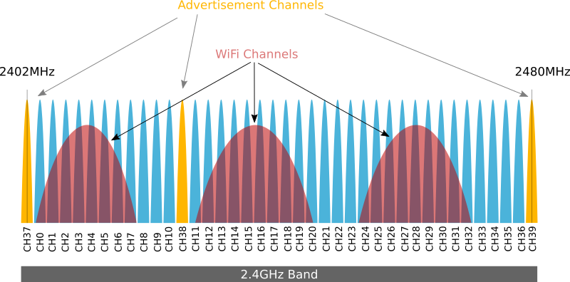
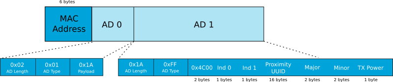
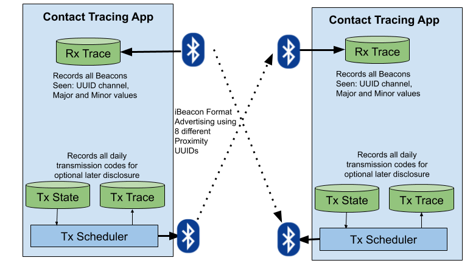
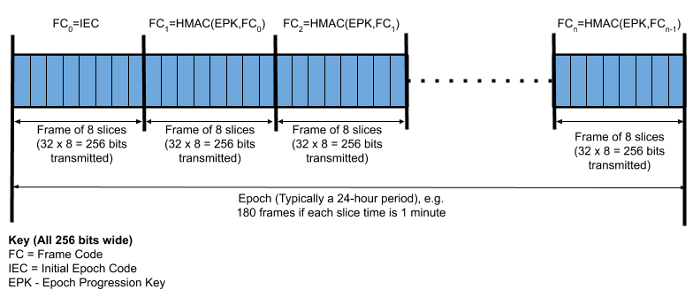
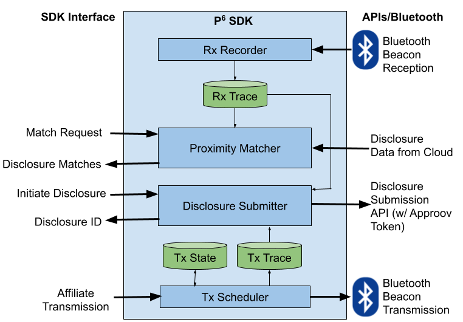
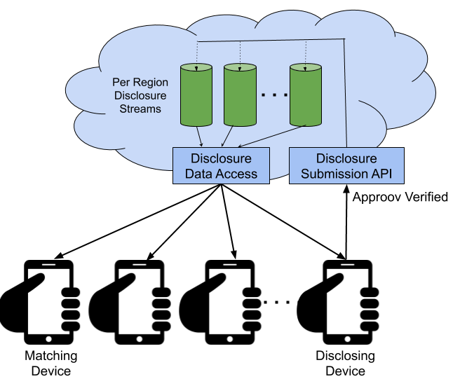
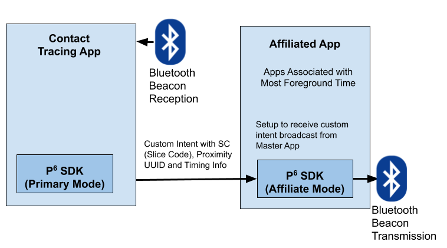
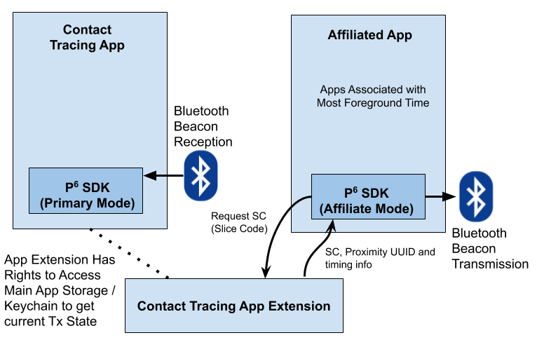

# **Privacy Preserving Proven Prior Proximity Protocol (P6)**

The authors of this paper may be contacted at `p6` at `approov.io`.

# Problem Statement

In the fight against COVID-19, the technique of [Contact Tracing](https://en.wikipedia.org/wiki/Contact_tracing) is used to determine prior contacts, so that these people may be warned that they have been placed at risk and should take preventative measures in case there has been transmission, such as self isolating. This is highly relevant to COVID-19 where there is a long infectious incubation period without symptoms. The contact tracing process can be done manually but is unreliable and cannot be scaled. Contact tracing is proven to flatten the all important R0 of infection propagation value whilst minimizing societal disruption.

Thus there is a need to automate this process using technology. Modern smartphones provide an ideal way to do this. They are ubiquitous and always carried throughout a large percentage of the population and have relatively accurate location tracking capabilities. Cloud side analysis allows location tracks of individuals to be analyzed to find intersection points and identify risks of transmission between individuals. At risk individuals can then be alerted early to allow behaviour modification as their infection risk has been elevated.

There has also been some past research on using Bluetooth as a way of communicating between devices in close proximity to perform this tracking. Bluetooth is a low energy radio protocol that is ubiquitous on modern smartphones. The challenge is to make this work at scale in a way that is compatible with existing devices in the field that doesn’t require significant changes to the use model of apps or the OSes that run on them.

We also discuss how a variant of this approach might also be used to evaluate the effectiveness of social distancing measures.

# Concurrent Efforts

Given the situation there is a burgeoning interest in this area, in the hope it can be rolled out quickly to fight the current COVID-19 outbreak.

A [highly relevant](https://www.wired.com/story/phones-track-spread-covid19-good-idea/) article was published while this document was in preparation (Sunday 15th March). This page mentions the [CoEpi](https://www.coepi.org/) project that plans to use Bluetooth scanning technology to identify devices. This seems to be in somewhat active development.

On Tuesday March 17th, Oxford University published this [release](http://www.ox.ac.uk/news/2020-03-17-infectious-disease-experts-provide-evidence-coronavirus-mobile-app-instant-contact#). It includes models showing how a contact tracing app could have a significant benefit in reducing the rate of infection.  It has more [data](https://045.medsci.ox.ac.uk/) with a policy piece and [presentation](https://045.medsci.ox.ac.uk/for-media) that has very similar concepts to the plan laid out in this document. There are no specific technology ideas around the app itself other than its use of location data tracking.

A news article from Thurs March 19th describes states “[Coronavirus: Mobile app that can trace and warn individuals of exposure to infected people is need of the hour](https://meaww.com/mobile-coronavirus-app-trace-warn-individuals-exposure-infected-people-experts)”. Another news story from March 19th indicates that the UK is about to roll out [location tracking](https://www.theguardian.com/world/2020/mar/19/plan-phone-location-data-assist-uk-coronavirus-effort), although it appears that individual data is still anonymized at this stage and the primary intent is to examine aggregated flows.

On Friday March 20th, Singapore launched the [TraceTogether](https://www.tracetogether.gov.sg/) app. This is an opt-in Bluetooth tracing app as explained [here](https://www.youtube.com/watch?v=6n9ZsHSc4YA). Another news article covers the [development](https://www.theonlinecitizen.com/2020/03/21/govtech-develops-tracetogether-app-in-collaboration-with-moh-to-boost-contact-tracing-efforts/). It appears the [app](https://www.tracetogether.gov.sg/) works by assigning each user with a randomized ID that is advertised over Bluetooth, and detected over scanning. The relationship between a user’s phone number and random Bluetooth ID is made known to the authorities but nobody else. The app needs to run in foreground on iOS due to the known restrictions of Bluetooth use imposed by Apple. This [article](https://mothership.sg/2020/03/trace-together-covid/) states that “The mobile number and its corresponding permanent ID are stored in a secure server. As an added layer of protection, TraceTogether creates temporary IDs that change regularly. Only these temporary IDs are exchanged between phones” so it would appear that a reasonable degree of privacy is maintained. A more detailed [FAQ](https://www.tech.gov.sg/media/technews/geeky-myth-busting-facts-you-need-to-know-about-tracetogether) deals with some of the concerns that users might have. On Monday March 23rd, a [commitment](https://www.straitstimes.com/singapore/coronavirus-spore-government-to-make-its-contact-tracing-app-freely-available-to) was made to open source the code and the underlying Bluetooth protocol [here](https://bluetrace.io/). There are also [reports](https://gadgets.ndtv.com/apps/news/coronavirus-india-developing-covid-19-tracker-cowin-20-app-reports-2201106) that India is developing an app that is partly based on Bluetooth proximity, although the privacy aspects of this app are very unclear at present.

A  good overview of the stance of various countries to digital tracking for COVID-19 is provided in “[11 countries are now tracking phone data as the coronavirus pandemic heralds a massive increase in surveillance](https://www.businessinsider.com/countries-tracking-citizens-phones-coronavirus-2020-3)”. In the [UK](https://www.wired.co.uk/article/uk-coronavirus-spread-app-phone-data) where NHSX is developing some kind of yet undefined, contact tracing app there is concern over the implications for [privacy](https://www.bbc.co.uk/news/technology-52003984). This [article](https://www.sciencemag.org/news/2020/03/cellphone-tracking-could-help-stem-spread-coronavirus-privacy-price) provides a good overview of approaches and methods to maximise privacy. There are also [suggestions](https://techcrunch.com/2020/03/29/test-and-trace-with-apple-and-google/) that the functionality could be built directly into the operating systems.

# General Challenges

As prior articles point at there are some general challenges with the approach:

*   The effectiveness of measuring proximity and how well this actually correlates to the chances of transmission
*   Whether the behavioural impacts of making the app available actually lead to societal level improved outcomes - e.g. would people tend to mix more given some sense of security of the app than they otherwise would
*   The app cannot track transmission through the environment itself, such as dirty surfaces, and if this accounts for some high percentage of actual transmissions then the proximity aspect is less valuable
*   The percentage of the population using smartphones that have the requisite capabilities. In particular these are much less prevalent in older age groups.
*   The impact on privacy, and how that impacts take up
*   Getting the population to use the app. A more difficult challenge in less authoritarian or communitarian societies.
*   Even if the use of the app is supposedly voluntary, there is a distinct danger that private actors will ask to see the status of a user in the app and might restrict access to locations for those who refuse to do this, or do not use the app. The design of the app should account for this possibility, perhaps by making it impossible to view the status more frequently than once a day (for instance) so that a user cannot be reasonably discriminated against for being unable to show their status.

# Known Approaches

## Cloud Proximity Matching with Pre-Existing Data Sources

Many apps already collect large amounts of data on our movements. Telecom companies are also tracking the cell towers being used all the time. In China there is a large network of CCTV with automatic face recognition in place already. Thus there is a plethora of relatively coarse grain tracking information already available. Normally there are significant concerns about the use of this data, but in the current circumstances it may be co-opted for proximity measurement. This seems to be the approach that [South Korea](https://www.smartcitiesworld.net/news/news/south-korea-to-step-up-online-coronavirus-tracking-5109) has taken and has demonstrated [success](https://www.sciencemag.org/news/2020/03/coronavirus-cases-have-dropped-sharply-south-korea-whats-secret-its-success). There are obviously massive privacy concerns around this approach.

## Cloud Proximity Matching with Dedicated App

In this case a specific app is launched and makes individual’s movements available in the cloud. If a user becomes infected then it becomes possible to retrace their movements and correlate them with others that can then be informed. Again, this comes with significant privacy concerns. See “[Iran Launched an App That Claimed to Diagnose Coronavirus. Instead, It Collected Location Data on Millions of People](https://www.vice.com/en_us/article/epgkmz/iran-launched-an-app-that-claimed-to-diagnose-coronavirus-instead-it-collected-location-data-on-millions-of-people).”

Similar moves in the [US](https://www.vox.com/recode/2020/3/18/21184160/government-location-data-coronavirus) have also been met with significant concern around the privacy aspects. 

## App Local Proximity Matching

In this case a specific app is launched that collects location data, but this is not transmitted to the cloud but remains only on the user’s device. The location traces of infected persons are then downloaded to the app and it locally checks the traces for proximity. It highlights any match, but this does not necessarily have to be communicated back to the cloud. If a person becomes infected in the future then they will need to publish their prior location trace for others to match against, so a privacy loss does occur in this case but only in the case of infection. Mechanisms could be put in place to redact areas around an individual’s home (or place of work), to minimise the privacy loss - although of course depending on the size of the redacted area this risks losing real proximity matches close to home.

On March 22nd Israel launched an [open source app](https://github.com/MohGovIL/hamagen-react-native) based on this model called the [Shield](https://www.grahamcluley.com/shield-israeli-coronavirus-app/). This particular app is read-only, in that a map of potential infection areas and times are downloaded from the cloud for local comparison against a user's movements. The app itself does not seem to have an ability to upload information if the user is found to be infected. It is unclear how this information is extracted. Perhaps it is only done using a manual process. 

An [MIT group](https://spectrum.ieee.org/the-human-os/biomedical/ethics/halting-covid19-benefits-risks-digital-contact-tracing) is also working on a similar concept, albeit at an earlier stage, called [Safe Paths](http://safepaths.mit.edu/). This may become part of an effort to build an official [WHO COVID-19 app,](https://www.theregister.co.uk/2020/03/23/world_health_organization_coronavirus_app/) that may include a contact tracing element in the future. A similar concept called [diAry](https://covid19app.uniurb.it/en/diary-lets-stop-covid-19-together/) is also being developed, referenced from this relevant Medium [article](https://medium.com/@rzanardelli/combining-covid-19-digital-support-to-citizens-without-compromising-privacy-a-model-5ee08383963f).

# P6 Approach

This discusses the new approach described in this document, a form of App Proximity Matching with excellent privacy characteristics meaning that even the person disclosing an infection doesn’t have to reveal their full location history. 

## Problems with the Alternatives

Alternative approaches might provide some of the basic capabilities for contact tracing, but have significant limitations:

*   The most significant is the coarse nature of the location information that can be collected. GPS traces are [notoriously poor](https://www.eff.org/deeplinks/2020/03/governments-havent-shown-location-surveillance-would-help-contain-covid-19) despite the theoretical accuracy when outside. Furthermore, GPS tracking is not possible indoors and location services need to fall back on other approaches such as Wifi ranging which have even lower accuracy. Thus the contact trace cannot be focused particularly accurately, requiring many more people to be asked to self-isolate and/or take additional measures than is necessary. This severely blunts the effectiveness of the approach.
*   Adoption of the apps may be limited by privacy concerns. This may be impacted by the actual approach taken (as discussed previously) and the level of compulsion and/or sense of civic duty associated with using the app. Even given the severity of the situation we face and the purported temporary nature of location tracking, there is a distinct danger that adoption now may lead to increased usage of such privacy invading techniques in the near future. An approach preserving privacy in an understandable and believable manner, as proposed here, should enable more widespread adoption.

## Description

The approach uses Bluetooth to exchange randomized codes between devices that are both running the required “contact tracing” smartphone app. Installation of the app does not require any signup or personal information to be revealed. The exchanged codes are fully anonymized and do not provide any information about the identity of the devices. Codes are not repeated for more than one minute so no tracking of individual devices is possible.

The app records a trace of the codes that have been received and their timings. This information is never transmitted to the cloud so full privacy is maintained. At some later point if a user has a confirmed case of COVID-19, they are able to make an anonymous “disclosure” and reveal the random codes that the app will have been transmitting at precise times on the prior days where there is a chance of cross-infection. Where the app was unable to transmit at those times the trace of other surrounding devices is provided to allow other devices to determine if they were in the same proximity and also receiving those codes.

All users of the app will receive the disclosure and the app will privately check for proximity. If so then they will be alerted to the fact that they may have been in contact with an infectious person, and the time(s) of that occurrence. This information is itself private unless they share this information with authorities (which may be possible in an anonymised way for infection tracking purposes).

Note that although we discuss the functionality of the contact tracing app in this document, we believe that the real contribution here would be made via an Software Development Kit (SDK) that could be used in a contact tracing app and implement the underlying proposed protocol.

## Advantages

*   The approach offers a provably private anonymized approach to tracing.
*   Its operation and inherent privacy properties are actually quite easy to explain and to be widely understood. Of course there may be some level of cynicism about the claims. This can be further disarmed by making the code open source.
*   Since proximity is based on actual close physical distance for some small, but sustained period, it should represent a good proxy of actual cross infection risk.
*   Control of Bluetooth transmission energy should allow the proximity range to be kept relatively low and provide enhanced accuracy over GPS location tracking approaches that are quite coarse grain and very poor inside (where infection rates are actually higher due to poorer ventilation)
*   It works without the need for cellular, Wifi or GPS contact - so ideal for many public transport scenarios 

## Challenges

*   This only works if a very large percentage of the population uses it. In order for that to happen it really needs the support of a very large tech company and/or Governments.
*   It is not clear if it is possible to transmit continuously if the app requesting the transmission is in background mode. This is certainly not possible on iOS currently. Thus it may be necessary to get a large number of major app vendors to integrate the SDK so that the transmit request is coming from their app which remains in foreground.
*   Although it appears reception for background apps when the phone is locked can be achieved, transmission when the phone is locked is less clear. This may require some changed user behaviour to have apps active (even more than usual) in public places to maximise effectiveness.
*   It may only be possible to measure proximity that is sustained for several minutes - although this will be correlated with chances of transmission.
*   It is only possible to measure actual proximity, not overlaps in location tracks that may have occurred some minutes after. 
*   There are wide variations in the Bluetooth transmission and reception power for different phones, and this may make any accurate approximation of distance very challenging. Some calibration across different phone types is likely to be required.
*   It will have some, as yet unknown, detrimental impact on device battery life.

## Approov Contribution

We are publishing these ideas in the hope that at least some of this will prove useful for the various groups now building Bluetooth based apps that aspire to preserve privacy. We do have expertise in the development of SDKs for iOS and Android, as well as the building of backend services to support apps at scale. Moreover, we also specialize in securing APIs against malicious actors, which may be highly relevant to a widespread deployment of such apps. Thus we are interested in working with partners to help build apps along the principles outlined, so they can be deployed at scale as quickly as possible. If you are interested in getting in contact to discuss this then please email `p6` at `approov.io`.

# Bluetooth iBeacon Technology

## Bluetooth Advertising

The Bluetooth protocol includes the ability for devices to advertise their existence to other nearby devices.  This is the mechanism that allows nearby devices to be seen and then connected to. Adverts are generated by devices on three different channels in the allocated spectrum for Bluetooth as shown below.

image from: [https://www.argenox.com/library/bluetooth-low-energy/ble-advertising-primer/](https://www.argenox.com/library/bluetooth-low-energy/ble-advertising-primer/)

The use of three different channels offers resilience if an individual channel is blocked due to interference, A device advertises on each channel, one after the other. The rate of broadcast is dictated by the advertising interval on the device. Since there is no synchronization between different devices, if the number of devices is too high and the advertising interval too low then there will be significant radio level collisions that cause data loss.

The advertising channels may also be used for beacons (such as iBeacons) that simply broadcast information on a periodic basis and are never connected to.

## Device Identification Approach

Note that a possible way to identify individual devices might be to simply advertise the device as a peripheral and provide some unique automatically generated ID as part of its name. Sufficient entropy may be available for global uniqueness, or at least sufficient uniqueness in combination with some geographic filter.

This ID could be assigned (anonymously) once and then held statically. This would of course undo the desired privacy preserving characteristics, since individual devices could then be tracked once acquired. Alternatively, the ID could be reassigned in some deterministic manner after a short period of time. These IDs could then be subsequently revealed if a disclosure for the device is made.

In order for a smartphone to be discoverable in this way, it would need to enable peripheral advertising. This requires Bluetooth Low Energy Peripheral support, and can only occur in foreground. In order to observe other devices which are advertising, it is necessary for a Bluetooth scan to be initiated. Again, it appears this can only be done in foreground mode (certainly on iOS, but should be possible to do it in background on Android as discussed [here](http://www.davidgyoungtech.com/2017/08/07/beacon-detection-with-android-8)). 

Instead of using a directly identifying ID in the advertising packet, the approach described here leverages the iBeacon standard. This has a number of advantages, not least that it is designed to allow beacon detection when the app is in background and even when the phone is locked. This allows continuous proximity scanning, even for a locked iPhone, which does not appear to be achievable by an attempt to do continuous scanning of nearby Bluetooth devices. Moreover, the background monitoring of iBeacons appears to have some hardware support which makes it considerably more power efficient. The downside of the iBeacons is that they are not designed to broadcast variable data so the protocol has to be somewhat abused to allow this, and the maximum potential data rates are limited.

## iBeacon Format

An iBeacon is a special form of a BLE advertisement that does Bluetooth connections. It uses a very specific format which is a subset of the overall Bluetooth advertisement format. The format is as follows:

image from: [https://www.argenox.com/library/bluetooth-low-energy/ble-advertising-primer/](https://www.argenox.com/library/bluetooth-low-energy/ble-advertising-primer/)

Many of the bytes are fixed in the format and, to be able to leverage existing support, it is not possible to modify those in any way.

In particular there is a 16-byte (128-bit) proximity UUID associated with the beacon. This would appear to offer plenty of entropy to represent an individual device, with some rotation function over time implementing privacy requirements. Unfortunately, however, the searching of iBeacons requires an app to look for particular proximity UUIDs known beforehand. Thus it is not possible, at least using high level iBeacon support, to use the proximity UUID as a way of communicating data directly. The idea is that a particular app is only interested in seeing beacons from a particular organization with a particular proximity UUID allocated and is notified when they come into range. On iOS there is a limit of 20 proximity UUIDs that can be tracked per app (with some underlying hardware limit of about 30 proximity UUIDs). Beyond that notifications are extremely slow and unreliable.

The protocol also includes a major and minor field, however. Each of these are 16-bits in length, giving a total of 32 bits. These are meant to be used for having multiple beacons (with the same proximity UUID) in the same area. This allows app use cases where different events may occur when a beacon with a particular major/minor value is encountered. The use case envisaged is that the beacon locations are fixed, and as the mobile device moves around it will get closer to particular beacons with certain major/minor values and this is notified to the running app. The fundamental insight of this protocol proposal is that this capability can be abused to transmit data between devices, by creating beacons with particular major/minor values that are only enabled for short periods of time (such as 1 minute). This will be detected as if the mobile device is moving between fixed beacons whereas in fact the beacons themselves are being modulated in a fixed position with different major/minor values. The hope is that this protocol will enable around 32-bits of data to be transmitted per minute between devices in close proximity. This is an astoundingly low data rate, but should be sufficient for post facto identification of specific devices.  

A Tx power is also transmitted. Given this information and the received signal strength this allows an assessment to be made of the distance of the beacon. This is a notoriously unreliable measurement, however, since it is impacted by so many environmental conditions. Transmit power will be kept very low so that only devices in very close proximity can receive the codes. This also helps reduce contention in a crowded environment.

All Bluetooth messages include a 48-bit MAC address. This identifies the physical device to allow it to be addressed for a connection. The size of the 48-bit value makes the likelihood of a collision extremely low. Ironically, in earlier versions of the Bluetooth standard no MAC randomization was performed, allowing individual devices to be easily tracked. This is of course exactly the use case we are now trying to implement. Most systems have now been updated with a new MAC randomization [scheme](https://www.bluetooth.com/blog/bluetooth-technology-protecting-your-privacy/). There does not appear to be a way to easily disable this temporarily or even to ascertain the randomized MAC being used at any given point. 

Note this randomization itself has some flaws as pointed out in this [disclosure](https://www.theregister.co.uk/2019/07/12/untraceable_bluetooth_exposed/). However, despite this flaw not being fixed as yet it is not useful since it requires continuous monitoring to spot the continuation of message data and associate a device with a new MAC.

## Device Support

The iBeacon format was devised by Apple and has been available on all iOS devices since iOS 7, so it is a relatively mature technology. Android support is less mature and requires BLE Peripheral mode to be supported in order to transmit. A [list from 2018](https://altbeacon.github.io/android-beacon-library/beacon-transmitter-devices.html) shows support to be a little patchy, but things have improved a lot since then. More work is needed on understanding what percentage of Android population support would be provided in different geographic territories.

# P6 Protocol

## Concepts

The basic iBeacon protocol is not designed to allow any transmission of data from the Beacon, There are various other beacon protocols that do allow this but these are not as widely supported so are not considered here. An iBeacon is designed to just transmit a globally unique UUID. A given app, listening for specific beacons, can then determine when one is in range and take specific action, perhaps looking up the unique UUID in a backend service.

Beacons have a 128-bit unique proximity UUID assigned to them. A specific UUID may be assigned to a particular company using iBeacons. The device may listen for signals being broadcast by a small number of beacons with specific proximity UUIDs.

## Inter-Device Communication

The following shows the communication between two different devices. In reality the protocol allows a given device to be receiving information which is being broadcast by an arbitrary number of devices. At least some of the time a given device will also be transmitting. As shown on the diagram below, the reception and transmission paths are somewhat independent.

Firstly considering reception, the device will be set up to listen for beacons on 8 different proximity UUIDs. The iBeacon protocol requires reception to be filtered on specific UUIDs so that the information can be filtered at a low (likely hardware) level before being sent to a listening app. Monitoring of beacons can occur in the background, even when the phone is locked. The events are passed to the app that records them in the Rx trace. Information includes the UUID channel and especially the 16-bit major and minor values which enable the code transmission. The timestamp of receipt is also important since the protocol relies on knowing when matching devices should be sending a specific code.

The transmission side uses a Tx state that holds the codes to be transmitted. A Tx scheduler determines which codes should be being transmitted at a given time slot. Transmission will typically require the app to be in foreground (especially on iOS) so the likely percentage time transmitting will be lower than that of reception. The implications of this are discussed in a later section. Information about what could be transmitted at certain times is stored in the Tx Trace. This is designed to be very compact, likely of the order of 80 bytes per day. If the app needs to make a subsequent disclosure then this means that the amount of information to be published and passed to all other instances of the app is suitably low.

## Randomized Code Generation

Random codes are transmitted by a device using an iBeacon. The transmission of these codes is loosely synchronized (to a tolerance of a second or so) between all devices. The codes may be received and traced by other devices. At the time of reception these codes are random and cannot be associated with any particular device. However, if the keys for those codes are subsequently disclosed it is possible for other devices to determine (with high probability) if they encountered that device at some prior point in time.

In order to minimize the amount of information that needs to be published in a disclosure, an algorithm is used to generate codes in a progressive manner throughout a day (called an epoch). Two 256-bit random values are generated securely on the device as follows, for each individual day of usage: 

*   _IEC (initial Epoch Code):_ Random code generated at the start of each epoch.
*   _EPK (Epoch Progression Key):_ Random key generated at the start of each epoch to evolve the random codes being transmitted through the epoch.

A key characteristic of the protocol is that individual codes are only transmitted for a short (approximately 1 minute) period, before the device moves onto a new code that is unrelated. Codes then evolve using the secret EPK. This means that it is not possible to track any individual device. It is generating a sequence of unrelated random codes that can only be matched later if the codes for that device are disclosed. Even when such codes are disclosed they cannot be associated with a particular user or device.

It is proposed that the secrets are evolved between frames using an HMAC with the EPK. This should generate sufficiently random results for the relatively small number of iterations required. If HMAC results don’t have sufficiently random properties then a pseudo-random generating scheme could be used instead, where the IEC is effectively a random chosen seed value for the epoch. The generator would need a sufficiently long repeat sequence to avoid attacks whereby the position in the sequence could be determined by an attacker at low computational cost, since that would reveal the future sequence in the epoch and allow an individual user to be tracked.

## Transmission Time Ordering

The following provides visualisation of the order of code transmissions that can be made by a transmitting device throughout the day. There are three levels in this timing:

*   **Slice:** A period of time during which the device will be transmitting a single 32-bit Slice Code (SC). It is envisaged that the SC transmission period will be of the order of 1 minute, but may be fine tuned later. Multiple broadcasts of the SC will occur during this period, depending on the advertising interval, to allow for poor reception and transmission contention.
*   **Frame:** A sequence of 8 slices makes a frame. Each of the slices transmits a 32-bit code, meaning that a full 256-bit code is transmitted during a frame. The frame code is set at the start of the epoch and then gradually progressed from frame to frame.
*   **Epoch:** An epoch is composed of many frames. Normally an epoch will be a 24-hour period, but in some cases it may be necessary to use shorter epochs (e.g. on initial app use to align with day synchronisation and after a disclosure event when the current epoch must end immediately). An epoch represents the shortest time period possible for a disclosure. 

Typically a device will not be continually transmitting throughout the epoch. However, the order of transmission must remain time synchronized as this is fundamental to the way in which the matching algorithm works, It must know the code that the disclosing device would have been transmitted at a specific time. Whenever the app is given the opportunity to transmit it will use the current time (based in UTC) to determine the current position in the transmission sequence.

Note that this requires to have a reasonable time synchronization. App updates to get disclosure events will also provide server time, from which a skew can be calculated for the actual time on the device. Note that this means large time adjustments on the time may cause temporary time synchronization loss.

Note that the broadcasting of an individual code will be repeated multiple times during the allotted slice time period, depending on the Bluetooth advertising interval chosen. This helps counteract poor reception or collisions between different devices broadcasting. Repeated codes received in the same slice period will be discarded.

## Proximity UUID Allocation

Codes may be transmitted on one of 8 different proximity UUIDs used by the protocol. By using different UUIDs we increase the chances that the monitoring capabilities of the devices can report simultaneous codes being received from different devices. Moreover, we can use the UUID as an additional source of data as it selects the particular slice within the overall 256-bit word that is actually being provided.

Note that there is still underlying radio space contention as the advertising channels are shared amongst all broadcast messages on any proximity UUID, but use of different UUIDs ensures that they are reported independently if only the strongest beacon is reported during the monitoring feedback. It seems to be the case that initiating ranging allows multiple beacons with the same proximity UUID to be reported in order of signal strength, but it is not desirable to have to depend on ranging rather than the simpler monitoring process.

There is a direct correlation between the proximity UUID being used and the particular 32-bit slice within the overall 256-bit code that is being transmitted. In order to reduce UUID contention between different devices the order of the use of the UUID channels within a frame is randomized. This means that the order that the 32-bit slice codes are sent is different for each frame. This increases the chances that at least some of the codes will be received.

The randomized order must be known deterministically so that the expected time slot within the overall frame is known when performing a matching operation. We do this by using 21 bits within the overall frame code itself. The first three bits are used to select the slice number for the first slice to be transmitted. The second selects the second slice as a count ignoring the slice already transmitted and so on. The effective number of bits of selection reduces for each slice, until there is no choice remaining for the final slice (hence why only 21 bits rather than 24 bits are needed, selecting 7 x 3 bits).

## Correlated Reception

One of the key technical challenges is that on iOS it is not possible to transmit iBeacons unless the app is in foreground (which also implies the phone isn’t locked). Android seems to have more relaxed policies around this, although it is not clear how long iBeacons can be transmitted for when an Android device is locked or the contact tracing app is no longer in foreground. Moreover, not all Android devices have full Bluetooth Peripheral support which would allow them to transmit in any case.

A couple of measures are proposed to help reduce the impact of these concerns:

*   It may be possible for Apple to relax their constraints about only foreground apps being able to transmit iBeacons, perhaps as some additional permission that may be provided to contact tracing apps that are shown to demonstrate sufficient care in handling privacy.
*   The concept of affiliate apps is discussed in this document. These are apps that are responsible for a significant proportion of foreground time on a device (e.g. Facebook, Twitter, TikTok, Instagram, Snapchat, YouTube, Browsers and other messaging apps). The idea is that these apps must be updated to also have the SDK, operating in affiliate mode, whereby the transmission is initiated in those apps.

However, notwithstanding the above, we must assume that the proportion of time that apps transmit will be much lower than the time receiving. Thus during the disclosure process, as well as disclosing the Tx state for the codes that may be transmitted by the app, the app should also disclose the slice codes it received in its Rx trace during periods when it was not transmitting.

This allows an assessment of co-proximity to be made. In other words, if a disclosing device was not itself transmitting then at least it can disclose what it was receiving. Any other device that received matching codes (to some level of confidence) during the same periods must itself have been co-located and in proximity. Thus, as long as there is one device transmitting in a particular area at the relevant time, it is possible to demonstrate proximity. Disclosure of the Rx traces does not meaningfully impinge on the privacy of those other users, since their Tx state that generated those codes remains private and it is not possible to identify who those co-located users were, unless they subsequently disclose their Tx state (remember this disclosure only only occurs if that app user is subsequently infected).

Note that the size of this disclosed Rx trace may be problematic for scaling, since it needs to be downloaded and checked by all participating apps. A compression scheme may be used to minimize the size when no data is being received. Moreover, some sub-sampling might be employed during especially busy periods.

Furthermore, other methods could be employed to remove information from other householders which do not need to be matched using the app:

*   The user may be able to set a home physical location (known only to the app) so that traces received while at home, where the number of contacts is presumably lower and better controlled, do not need to be transmitted on a disclosure.
*   At the time of a disclosure a capability could be provided to remove all the Rx trace records that are likely to be associated with household members who are also using the contact tracing app. This could be done using a peer-to-peer sharing option over Bluetooth. This would allow other householders to choose to disclose their prior Tx information to the disclosing app user. This would allow local removal of those Rx records, before the disclosure to the cloud. Thus householder Tx information would not itself be transmitted any further and would be erased once the operation is completed.

## Disclosure Proximity Matching

A disclosure consists of the Tx trace for various epochs, along with a subset of the Rx trace for those epochs. A match must be performed against both:

*   _Tx Matching:_ The matching process must look at each disclosed epoch Tx state and compare it against the Rx Trace to determine if there has been a match. A progression is made through the codes that would have been transmitted by the device, and therefore potentially received had the transmitter been in proximity. The algorithm allows the code progression, and the exact timing thereof, to be known throughout the epoch. A match occurs if there are more than a certain number of matching slice codes within a clustered time period.  The Tx matching might be restricted to those times when there is no corresponding Rx trace (since the Rx trace is only supplied for periods when there is no transmission).
*   _Rx Matching:_ This matches the Rx trace against the slice codes received on the device at the same time. A clustering of slice code matches indicates that the device must have been in the same proximity as the disclosing device, receiving data from some set of unknown transmitting devices.

## False Positive Suppression

As discussed, a proximity match requires several slice code matches in a short time window.  The number of matches and the size of the window must be carefully assessed. Incorrectly setting parameters could lead to a high rate of false positives, which we obviously must avoid. False positives must be rendered very low probability events even in the face of the sort of scale of deployment that might occur.

As a back of envelope calculation, consider that the app is receiving a new slice code every minute. This assumes the app is active all day, and is always receiving codes from one other device. In reality a device will likely only be active for part of the day, but may experience a higher number of slice code receptions per minute from surrounding devices when it is active.

For the 32-bit slice code, the chance of a collision is only 1/232, but in a day there will be 3600 minutes of such slice codes being received. Any of these could result in a collision. Thus the chance of there being no collisions in the day is (1 - 1/232)1440. However, there are other factors to consider such as the fact that multiple days and disclosures are being matched. Moreover, we need to be able to cope with millions of users of the system and we don’t want any of them, ideally, to experience a false disclosure proximity match on their data.

Note that we are also assuming that received slice codes can be delivered quickly enough when the app is running in background, and the time stamp of reception is sufficient to reliably allocate it to a particular slice period. If not, and the delays make the timing much more approximate, then this would substantially increase collision probabilities in our matching algorithm. For now, we assume that slice period time synchronization for reception is guaranteed in our approach.

We have to assume that a cluster event will be required to announce an actual match. Multiple matches need to occur as a tightly clustered event in time during the day. Let’s consider a matching period of 5 minutes. Let’s conservatively assume we wish to see three different matches in that period, from the disclosed epoch information. We have a probability of 1 - ((1 - 1/232)5 ) of a collision for each slice code, which is 1.16 x 10-9. Thus the probability of seeing 3 such independent collisions within the 5 minute time window is (1.16 x 10-9)3. This is 1.577x10-27. For the calculation (1-(1.577x10-27))720, representing 720 five minutes periods in a day, this gives 0.99999999999999999999999886456. This appears to give almost certainty that for a given epoch disclosure we will not achieve a random collision of 3 different slice codes within a 5 minute period. Thus we can be sure that such a match is real.

As discussed, in reality we will be matching multiple epochs, and many different disclosed epochs per day. Moreover, we may wish to use a sliding window period of 5 minutes rather than strict 5 minute slots and this increases the chances of collisions. Overall the collision probability seems suitably low, assuming a proximity of three slice codes is sufficient. This implies a real actual proximity of several minutes and reasonable levels of signal transmission.

A small simulation for this has been performed. The code is available in this repo in the `collison-simulator` directory. The size of the simulation is somewhat limited by memory and CPU time for the basic implementation that exists. It tests randomized disclosures against a cohort of 150000 receiver traces for a single epoch (i.e. a day’s worth of data) The number of disclosures tested was 75000. Again, each is an epoch. So 75000 disclosure epochs against 150000 reception epochs. This is small scale compared with a real implementation but should reveal any fundamental shortcomings. The reception uses a profile where 50% of the time nothing is being received, but the rest of the time there are various receptions per slice, up to 7 at a time (but this is only reached about 5% of the time). A full match requires 3 matching individual slices in a 5 slice period moving window. The results showed approximately 5000 individual slice code matches, but no full matches in the run of the simulation. A further run indicated that on this smallish sample there were not even any matches of two slice codes within a 5 slice period moving window.

# P6 SDK Operation

## Architecture

The internal architecture of the SDK may be viewed as follows. Beacon reception and transmission are relatively independent and, as far as can be ascertained, both can occur simultaneously. Each component is described at a high level in the following sections.

The SDK can be operated in one of two modes:

*   _Primary Mode:_ Normal operation of the SDK, recording Rx and Tx traces. Used inside a contact tracing app.
*   _Affiliate Mode:_ This is the mode used if the SDK is embedded inside some affiliate app. In this case the SDK does not do any tracing, but only transmits over Bluetooth to enable continued transmission while the affiliate app is in the foreground (where transmission is restricted to foreground apps only). 

## Rx Recorder

This is responsible for performing iBeacon monitoring operations. The app will be monitoring a total of 8 different UUIDs that have been allocated for the purposes of the proximity tracking. The app will receive callback events when entry to and exit from a particular region occurs. This will have an associated UUID for the iBeacon, along with the Major and Minor values which are the primary mechanism for transmitting code data. When a region entry event occurs, a ranging operation may be initiated that can provide more details of the beacons currently transmitted, including estimates of their distance.

Events are recorded in the RxTrace with all the associated metadata, including time of receipt. Beacon events that may have been transmitted by the device itself need to be filtered out, presuming the HW or OS does not do that already.

This monitoring process will continue in the background, even when the phone is locked, and significant care must be taken to minimize power usage to avoid excessive battery drain.

If Bluetooth is not enabled then this module must prompt the user to enable it.

## Rx Trace

This trace provides a record of all of the iBeacon events observed by the device. This is later analyzed against disclosure information to determine if there is a sufficient match, and therefore a notifiable event to the user. A compressed form of the Rx trace may also have to be disclosed for the periods when no transmission could be made, to help co-locate with other app users.

Information to be stored includes:

*   Timeslice of the event (this is based on timestamp provided, and all codes will be allocated to a particular slice of approximately 1 minute in duration)
*   Major and Minor values for the iBeacon as this is the primary code transmission mechanism. Together they form the SC (Slice Code).
*   The slice selection derived from the received UUID (to determine which slice to be matched)
*   Potentially, the distance estimation to be used in a calculation of the match strength. Alternatively, the approach could simply impose a maximum limit on the distance estimation and ignore all slice codes exceeding some fixed threshold.

The RxTrace only needs to be kept for a fixed maximum period, greater than the maximum prior proximity period that may be disclosed. In practice, this would be something like three weeks,

Some effort should be made to protect this data at rest to ensure complete privacy, perhaps encrypting using a key stored in the hardware trust layer.

As discussed above, the Rx Trace may also include an overall location trace of the app user for analytics purposes.

## Proximity Matcher

The matching engine requests the disclosure stream(s) that the app is subscribed to. Each stream represents the data for one particular region. The requests will be done on some periodic basis when connectivity is available. The timestamp or position of the last disclosure received will be remembered, so only the updates need to be transmitted each time.

The new disclosures are received as a sequence of data for epochs being disclosed. The algorithm is discussed in the Disclosure Proximity Matching section above. 

If there is a match (or matches) then the proximity matcher will provide the information about the time and duration of the match and the physical location of the match if that is also being tracked by the SDK. The unique Disclosure IDs will also be provided. This can be used to lookup other metadata associated with the disclosure by the contact tracing app using the SDK.

## Tx State

This represents the current state which is being transmitted by the app. It is composed of the following data:

*   _IEC (Initial Epoch Code)_: A 256-bit random code that is generated as a secure random number at the start of each epoch. The individual codes are derived from this.
*   _EPK (Epoch Progression Key)_: A 256-bit key value used in an HMAC to determine the next code value in each frame. Since this key is secret an observer cannot determine the relationship from one frame to the next, and is thus unable to track a device unless this code is later disclosed.
*   _FC (Frame Code)_: The current 256-bit frame code that is to be transmitted. These are sent as a sequence of 32-bit Slice Codes (SC) during the frame. This FC is initially the same as the IEC in the first frame, and is transformed in each frame using the EPK.

## Tx Scheduler

The Tx scheduler is responsible for determining the sequence of beacon codes to be transmitted and how long each should last in duration. It advances the Tx state as required, from frame to frame. It also writes data to the Tx trace at the start of each epoch.

## Tx Trace

This records information about prior codes that may have been transmitted by the device. Some of this information may be published by the app if a future disclosure is required. A trace is provided for each epoch as follows:

*   Start time of the epoch (in UTC Linux time)
*   Duration of the epoch (normally 24 hours, but may be shorter)
*   Slice duration (individual slice durations may be configured server side for the app in order to fine tune the efficiency of the transmission in the protocol)
*   IEC (Initial Epoch Code) that was used
*   EPK (Epoch Progression Key) that was used

Given this information it is possible to determine the codes that may have been transmitted by the device at any point during the epoch, using the base time as the epoch start (in UTC) and replaying the deterministic code derivation algorithm. A record must also be made of whether the SDK was able to transmit in any given time period.

This provides an extremely compact representation of the information that may have been transmitted during a day. The IEC and EPK codes are 256-bits (32-bytes each), and the other information could be likely to be represented in 16-bytes or less. So epoch information only needs about 80 bytes, i.e. the data for a single day.

If we consider that the number of epochs (assuming an epoch normally being one day) typically disclosed will be of the order of 10, then that means that an individual Tx disclosure is only of the order of 800 bytes. Unfortunately the Rx trace that may need to be disclosed is significantly larger than this. 

The Tx trace should ideally be encrypted at rest for maximum security.

## Disclosure Submitter

The submission process is provided with some metadata to be sent and the start time from which the disclosure is being made. This time is used to determine the epochs that need to be included in the disclosure. The IEC and EPK secrets for the appropriate epochs, along with their time ranges, are provided. Furthermore, the Rx trace for the periods when the SDK was not transmitting are also disclosed, allowing co-located users seeing the same codes to be matched. This information is included in the request to the disclosure API and it then becomes public domain.

The disclosure API backend allocates a unique Disclosure ID for the disclosure that is included in the record. The contact tracking app itself may then associate further metadata with the disclosure using its own backend resources. This is outside of the scope of this document and may be determined during the development of the contact tracking app itself.

Note that in general the disclosure will only be made for a particular country (or larger region thereof for larger countries). Logic in the contact tracing app may allow multiple disclosures to be made across different countries if the user states that they have visited them during the prior disclosure period.

A significant security risk of the disclosure process is that there is no user authorization component due to the privacy design of the system. This means that malicious spoofed disclosures could be made against the endpoint, with the intention of increasing data sizes and causing random matches.  This attack vector must be controlled. It is thus proposed that Approov is used to protect this endpoint, so that only valid instances of the contact tracking app can make requests to the endpoint.

Note that when the disclosure is completed the current epoch must be ended immediately. This is because the information will then be in the public domain, allowing any device to spoof the identity of the disclosing app instance. This is of course also why proximity matching must stop at the exact time of the disclosure since any data after that point cannot be trusted.

# P6 SDK Backend

## Architecture

The SDK is set up to communicate with some backend resources. We envisage that each geographic region will have an associated stream of disclosure events that can be submitted by valid instances of the contact tracing app(s). This needs to be designed to allow very significant scalability, both in terms of the reading and writing sides of the disclosure database. The size of the region will depend on the practical scalability of the solution and, in particular, the size of the disclosure information that each app must download every day. We would hope that an individual region can be very large, however, encompassing many millions of individual users if not entire smaller countries.

## Disclosure Data Access

Each of the mobile devices running the contact tracing app must update periodically for recent disclosures for matching against. We envisage that only data from the relevant region(s) is to be read. The contact tracking app itself could provide facilities to do matches over multiple regions if required.

Scalability of the reading of this data is fundamental, and would need to be fronted by some kind of CDN capability. Fortunately the data being transmitted to all app instances is identical so this is easy to achieve. One possibility is simply to put the disclosure data in files in S3 buckets in AWS, with one new file written each hour with all new disclosures. This bucket can then be made readable via AWS CloudFront. The SDK just needs to download and process the disclosures files which have become newly available since its last update. 

## Disclosure Submission API

A disclosure consists of Tx data for several epochs and with a time range around them. The disclosure must also include the Rx trace for all periods when the SDK was not transmitting. A compression scheme will be applied to this, but in general this Rx data will be significantly larger than the Tx data.

When a new disclosure is received it is added to the queue to be included in the next update for the region. Disclosures should only be accepted from valid instances of official contact tracing apps. One approach to doing this is by restricting access using [Approov](www.approov.io) tokens, which prove the authenticity of the app. This prevents spoofed or scripted disclosures being made maliciously. Other authorization mechanisms may also need to be in place on this API depending on the contact tracing app and its stance on “self-disclosure” or whether some official authorization (perhaps based on a positive COVID-19 test) is required.

# Contact Tracing App

## Overview

The contact tracing app provides a User Interface and general business logic over the top of the P6 SDK itself. The exact nature of the steps in the app and how things are presented are beyond the scope of this document, but some basic requirements and ideas are presented here.

In general a user should only install a single contact tracing app, should there be a choice in the future. This is because the contact tracing app will hold the Rx and Tx traces (managed by the SDK) and will be responsible for their secure storage. We only wish one app to be monitoring for beacons in the background and recording the traces, and we only want one app performing the transmission. Thus there is only a single app that the user needs to go to check for matches or to make a disclosure. As discussed later, there is the option for affiliate apps to interact with the single chosen contact tracing app as required.

## Installation

A key attribute over the P6 contact tracing system is that it remains anonymous. Thus it should be possible to install the app and start receiving and transmitting with absolutely no need to sign up or enter any personal information. This is a key aspect of overall design philosophy and individual contact tracing apps should not deviate from this approach.

Since the app will require access to Bluetooth and location services, requests for these rights should be made on first installation and startup of the app.

## Optional Location Tracking

There may be an option to determine if the user wishes to track their physical location or not while tracing. This is not done by the P6 SDK itself, but the overall contact tracing app may implement this. The primary purpose of this would be to inform the user where a proximity event with a disclosed user occurred. The P6 SDK provides the timestamp of the event from which the location can be looked up inside the app. There is no need to disclose the full trace of locations, but a user agreeing to provide the specific locations of proximity may be useful to authorities to determine where significant numbers of events are occurring and inform other users. 

Note that this disclosure of location may then form the basis of a secondary level of disclosure, outside of the scope of the P6 SDK itself. This secondary disclosure would show the time and location of a proximity event that has occurred with a disclosed, infected, user. The apps are then able to determine if they were at that location at that time, or shortly afterwards, where there may be some, albeit reduced, risk of infection. The app could simply inform the user of this in case they wish to take some remedial action. Note that the location intersection checking can be done locally in the app and does not require location information to be published to the cloud so privacy is assured. 

## Normal Operation

The app should be able to record beacons while running in the background and while locked. Some sort of indication should be made to the user that the app is running. Operations may also be initiated via affiliate apps. 

The app could provide some kind of feedback about the amount of time it has been tracing and/or transmitting. Perhaps with some kind of timeline of the days, but this is really not essential functionality. It could display the number of slice codes that have been received, but this is not a proxy for the number of physical constants since the privacy preserving aspects of the protocol mean that it is not possible to determine this. Note that a count of the number of Bluetooth MACs seen may be a better approximation, assuming a constant rotation rate for different devices, but mobile OS’s prevent this information from being extracted.

## Proximity Match Request

When initiated by the user, or perhaps on an hourly timer, the contact tracing app should fetch the latest disclosure information from the cloud. It is then able to compare this against the latest disclosure information. This may result in one or more matches, each being assigned with some level of confidence and duration based on the number of matching slice codes. The time of the matches is also provided along with the Disclosure IDs that matched.

This information can then be presented to the user so that they are able to take appropriate actions, such as self isolation for a period. The disclosure ID may be used to lookup additional information (outside of the scope of P6) regarding the disclosure, such as symptoms and the authority of the disclosure and whether there was an actual positive test or not. The app should of course provide sufficient and locally appropriate advice and support around this.

An option may also be presented for the user to submit their match information (including, optionally, some resolution reduced physical location) to some other backend system for tracking the spread of infection.

## Disclosure

The key functionality of the app is to be able to make a disclosure. This discloses that the user has now been diagnosed with COVID-19 and wishes to disclose this to proximity contacts made for N days previously that this is the case. The actual identity of the user is never disclosed. Medical advice will be used to help choose N, which is the period during which the user may have been infectious.

Typically the user will also fill in some kind of questionnaire to determine with a high degree of confidence that they have really contracted COVID-19. In general it cannot be assumed that tests will always be available. The approach and advice on this will obviously vary from time to time and by country, and this needs to be adhered to by the contact tracing app. In some cases an official authorization identifier (which will be checked by the disclosure API backend) may be required.

When the disclosure is made via the P6 SDK,  a unique Disclosure ID is returned. This may be used as a key for storing other metadata associated with the disclosure. This can then be stored in the cloud to be accessed by contact tracing apps which subsequently show a proximity match for the disclosure.

The app may allow the disclosure to be made in several different regions if the user has been travelling. Disclosures must account for the different advice in place for a disclosure in different countries.

## Affiliated Apps

On some platforms, such as iOS, it is not clear if beacon transmission can occur for background apps. This seems to be more of an issue on iOS than Android, but may vary  depending on model and particular OS version. Thus we need to have the SDK integrated into apps that are associated with a high percentage of foreground time in different markets (Facebook, Instagram, Twitter, Snapchat,  Messaging, TikTok, etc. etc.). Each affiliate app will be linked to a particular contact tracing app which will communicate with the affiliate. Ideally some common app will emerge for each country, but this is really a discussion between the contact tracing app and affiliate app partners and is outside the scope of this document. When the SDK is run in affiliate mode it simply sends Slice Codes with timings as dictated by the contact tracing app itself. This is simply to make sure the Bluetooth start advertising calls are in the context of the affiliate app which will be used in the foreground.

This mechanism requires some communication between the contact tracing app and the affiliate app, as discussed below for iOS and Android.

### Android Affiliated App Communication

Note that the requirement for this in Android appears to be much lower than for iOS, since it is possible to transmit when the app is in background. However, this is included for the sake of completeness.

The contact tracing app can send custom intents on a periodic basis (say 1 minute), with the latest Bluetooth codes to be transmitted. Affiliate apps can register for the custom intent broadcast and, if they are in foreground, use the SDK in affiliate mode to initiate the beacon transmission for the prescribed short period.

### iOS Affiliated App Communication

The affiliated app can make requests to the contact tracing app on a regular basis. This accesses an app extension that has the rights to access the data for the contact tracing app, and call the code in the SDK. This will obtain the latest transmission requirements to be returned to the affiliate app for transmission by the SDK in affiliate mode.

## Revocation

The app may wish to support some mechanism for revoking prior disclosures, if they were somehow done in error or maliciously. This can be done outside of the disclosure stream by having an independent cloud database of Disclosure IDs that have been subsequently revoked.

# Security Threats

These are general and residual concerns about the security of the system.

## Fake Disclosures

Scripted attacks against the endpoint are protected by the use of Approov tokens. Limits will be placed in the minimum time the contact tracing app must have been active for (say 24 hours) before disclosure can be made, to avoid automated app installation and disclosure attacks.

## Excessively Powered Transmission

A variant of the app could transmit on the maximum Bluetooth power available, rather than the power level normally chosen for the app. Alternatively custom hardware could be used to transmit at higher power levels still, beyond the maximum levels normally allowed for Bluetooth. This would have the effect of jamming more local transmissions to some extent. Moreover, where matches are done on Rx traces to find co-located devices this would excessively widen the area of apparent proximity.

## Receive Only Freeloaders

This isn't a security threat as such, just a concern about the proper usage of the approach. To be effective, the app must transmit when it can and be prepared to disclose its Rx traces for periods when it cannot transmit. If the app code is open source and the disclosure stream is public, it would be possible to build an app that does not conform to this requirement and selfishly only receives and looks for proximity matches. Of course a similar effect can be achieved by using the official contact tracing app, but then not disclosing any subsequent infection.

## Scaled Replay

In principle an app could be developed that synchronized codes across a large number of devices in many different locations. If a disclosure were then to be made against those replicated codes it could then match a very large number of users, causing significant disruption. This can be mitigated against by the reports submitted by users that believe they have a match. If there are too many for an individual disclosure to be believable then a revocation could be issued. Note that another advantage of using Approov is that the disclosing app itself couldn’t perform this bad behaviour. It requires a relay via Bluetooth app to be built that adds complexity into the attack.

## Scaled Cloud Tracing

An elegant aspect of the approach is that the codes transmitted by the app over Bluetooth are ephemeral. If no recording of them is made then they are lost. Codes are changing in a sequence that can only be determined if a future disclosure is made. Only those users that actually collected the codes can know the location of the contact. However, it is possible that if there were a large number of mobile receivers (or fixed recording beacons) then the data could be pooled after a disclosure to determine a more detailed path of the disclosing user during the disclosure period. A large network of collaborating receivers would be required, however, to significantly undermine privacy in this way.

# Social Distance Measurement

## Overview

We also believe that Bluetooth could play a key role in measuring the adherence to recommended social distancing guidelines. This will be one of the major challenges society will face in an exit strategy from the lockdown that much of the world is currently in. These measures will no doubt have a massive impact in flattening the curve of the infection rate. However, assuming that no widespread COVID-19 vaccination programme is available within the coming months, then we need to plan a gradual controlled exit from a household level isolation strategy. It is expected that [social distancing measures](https://www.bbc.com/future/article/20200324-covid-19-how-social-distancing-can-beat-coronavirus) will be in place for some considerable time to come and enhanced ways of measuring this, and providing behavioural nudges to everyone to help maintain them, would be highly beneficial.

Mapping of social distancing is [already occurring](https://www.vox.com/recode/2020/3/26/21192653/coronavirus-privacy-social-distancing-data-collection-unacast), using anonymized phone cell data from the telecom companies and data from [apps already collecting location data](https://www.washingtonpost.com/technology/2020/03/24/social-distancing-maps-cellphone-location/) at scale. This is not even a new use case, [Google](https://www.theguardian.com/technology/2016/nov/22/google-bar-shop-busy-real-time-live-data-black-friday) has been using such aggregated data to show how busy locations are on maps at different times of the day for years, or for showing live traffic congestion data. However, the current data (primarily from GPS tracking) is relatively coarse grain, especially for indoor locations and on public transport where social distancing is even more important.

It appears that what is needed are technologies that allow much more personalised feedback and advice on achieving good social distancing, as well as finer grain aggregated information to measure progress and problematic locations. Such measures are in direct conflict with widespread acceptability of [privacy invasive tracking](https://www.businessinsider.com/countries-tracking-citizens-phones-coronavirus-2020-3). By its nature, personalised measurement of social distancing requires that location data will have to be uploaded from individual apps to allow comparison with other users. It is very difficult to fully anonymise such data, since the presence of certain locations such as home or work provide an almost direct means of identification.

Bluetooth provides an innovative alternative solution to this problem. It allows the direct estimation of the number of people within a certain distance using ubiquitously available smartphones. Moreover, the collection of such data does not reveal locations or the identity of any app users. It merely provides a means to measure the numbers in close proximity over time, which is the key metric that needs to be evaluated and optimised.

## Approach

These are the key principles of an app that we envision that could use this technology:

*   Users install the app but do not need to sign up or divulge any personal information during this process. Use of the app is always completely anonymous. This could be the same app as a contact tracing app, or could be entirely independent.
*   The app will ask for permissions for access to Bluetooth and also tracking of location. When the app is running the app it will collect location and Bluetooth information in the background. This information is only held in the app and not shared without user consent.
*   The app will continuously listen, in the background, for Bluetooth [iBeacon](https://en.wikipedia.org/wiki/IBeacon) broadcasts being made by other users running the same app in close proximity. Whenever possible the app will also be broadcasting these beacon signals.
*   The app can generate Bluetooth codes as described in this document (although if the application is confined to social distance measurement only, then of course the protocol can be much simpler).
*   The app will record the number of other devices it can receive broadcasts from that are in close proximity in a given time period, leveraging the fact that each will likely be broadcasting a different code at any given point. This provides an estimate of the number of other users of the app in close proximity at any point in the day. The app may associate this with a physical location.
*   The user of the app will be able to view a mapped trace of their location history overlaid with a proximity heap map. This will help users see times and locations where they have had the least social distance over the day. 
*   Data from previous days will be automatically deleted after a short period, such as a week.
*   With the consent of the user, an overall metric of their social distancing can be shared to a central service as part of an aggregated picture. Again, this is fully anonymised and would only contain extremely coarse grain location data.
*   The app could highlight times and locations during the day where the level of proximity was particularly high (perhaps compared to an average for all users of the app). With the consent of the user, this information can be shared to a central service to help provide an aggregated picture of congestion. If the user chooses to share this information, it will remain anonymous and will only ever share a point location and time.
*   Users of the app should be able to view this aggregated view, helping them to be more mindful of where they go and at what times. This can help smooth out demand in places where congestion is problematic. The app could even help with sharing location based tips on social media (making social distancing social!).
*   Authorities can monitor the aggregated information and take appropriate action if required to remediate the situation. The overall measurements should also allow closer monitoring of social distancing over time in different areas, and help modulate public statements about behaviour patterns.

## Advantages

*   It provides a way for individuals to contribute their data anonymously and make them feel that they are doing their bit in the efforts to contain the virus.
*   By allowing comparison with others, the app helps gamify the process of social distancing, give feedback and advice and helps nudge behaviours in a positive direction.
*   The operation and inherent privacy properties are actually quite easy to explain and to be widely understood. 
*   Since proximity is based on actual close physical distance for some small sustained it should represent a good proxy of actual cross infection risk.
*   Control of Bluetooth transmission energy should allow the proximity range to be kept relatively small and provide enhanced accuracy over GPS location tracking approaches that are quite coarse grain and very poor inside (where infection rates are actually higher due to poorer ventilation).
*   It works without the need for cellular, Wifi or GPS contact, so is ideal for many public transport scenarios.

## Challenges

*   This only works if a very large percentage of the population uses it. In order for that to happen it really needs the support and promotion of large tech companies and/or Governments.
*   On iOS in particular, there are severe restrictions on Bluetooth transmission by apps that are not the main one running in the foreground, with the phone unlocked. This may lead to under counting of proximity since iPhones will be less present. This challenge could be overcome by Apple relaxing its Bluetooth transmission rules for such apps and/or major app vendors including a transmission SDK in their apps so the signal is present if that app is active. There are also some models of Android phones which are unable to transmit.
*   It is notoriously difficult to get accurate proximity measurements using Bluetooth, although for the purposes of this app estimations may be sufficient and these are certainly higher quality than attempting to use GPS indoors. 
*   It will have some, as yet unknown, detrimental impact on device battery life.

## Householder Proximity Exemptions

If multiple members of the household are using the app, then proximity to them will also be included in the statistics collected by the app. In the approach discussed, it is not possible to exclude them from the data because the Bluetooth slice codes transmitted are randomized and cannot identify a particular user. This may have the effect of biasing the data since these contacts should not be included in social distancing statistics gathered.

One possible way around this issue is to make it easy for householders to do peer-to-peer sharing of their IEC and EPK values each day. This could perhaps be done via an onscreen QR code or via Bluetooth. This will allow the apps of householders to ignore each other as far as the social distancing metrics are concerned. These values are not revealed to anyone else, nor any central authority, the privacy guarantees of the system are not undermined.

Note that if peer-to-peer sharing of keys is allowed, then it may be beneficial for the app to predetermine the IEC and EPK values for multiple days ahead to reduce the needed frequency of this sharing. A user of an app would always have the option to reset future values if they no longer wished to have the sharing enabled.

# Resources

## General

[https://en.wikipedia.org/wiki/IBeacon](https://en.wikipedia.org/wiki/IBeacon)

[https://medium.com/combo-fm/hacking-with-ibeacons-what-i-wish-id-known-475968f790f7](https://medium.com/combo-fm/hacking-with-ibeacons-what-i-wish-id-known-475968f790f7)

[https://www.radiusnetworks.com/2018-11-19-beacon-monitoring-in-the-background-and-foreground](https://www.radiusnetworks.com/2018-11-19-beacon-monitoring-in-the-background-and-foreground)

## iOS iBeacon Support

[https://developer.apple.com/documentation/corelocation/ranging_for_beacons](https://developer.apple.com/documentation/corelocation/ranging_for_beacons)

[https://developer.apple.com/documentation/corelocation/determining_the_proximity_to_an_ibeacon_device](https://developer.apple.com/documentation/corelocation/determining_the_proximity_to_an_ibeacon_device)

[https://www.silabs.com/community/wireless/bluetooth/knowledge-base.entry.html/2015/08/06/_reference_backgro-c6u4](https://www.silabs.com/community/wireless/bluetooth/knowledge-base.entry.html/2015/08/06/_reference_backgro-c6u4)

[https://stackoverflow.com/questions/18944325/run-iphone-as-an-ibeacon-in-the-background/19941436#19941436](https://stackoverflow.com/questions/18944325/run-iphone-as-an-ibeacon-in-the-background/19941436#19941436)

[https://community.estimote.com/hc/en-us/articles/203914068-Is-it-possible-to-use-beacon-ranging-in-the-background](https://community.estimote.com/hc/en-us/articles/203914068-Is-it-possible-to-use-beacon-ranging-in-the-background)

[https://developer.radiusnetworks.com/2015/04/21/max-beacon-regions-ios.html](https://developer.radiusnetworks.com/2015/04/21/max-beacon-regions-ios.html)

[https://stackoverflow.com/questions/19316065/ibeacon-bluetooth-low-energy-ble-devices-maximum-number-of-beacons](https://stackoverflow.com/questions/19316065/ibeacon-bluetooth-low-energy-ble-devices-maximum-number-of-beacons)

[https://developer.apple.com/library/archive/documentation/UserExperience/Conceptual/LocationAwarenessPG/RegionMonitoring/RegionMonitoring.html](https://developer.apple.com/library/archive/documentation/UserExperience/Conceptual/LocationAwarenessPG/RegionMonitoring/RegionMonitoring.html)

[https://stackoverflow.com/questions/28255475/detecting-beacons-via-ibeacon-monitoring-ranging-vs-corebluetooth-scanforperip](https://stackoverflow.com/questions/28255475/detecting-beacons-via-ibeacon-monitoring-ranging-vs-corebluetooth-scanforperip)

[https://github.com/RadiusNetworks/proximitykit-ios](https://github.com/RadiusNetworks/proximitykit-ios)

## Android iBeacon Support (especially with AltBeacon Library)

[https://developer.android.com/guide/topics/connectivity/bluetooth](https://developer.android.com/guide/topics/connectivity/bluetooth)

[https://os.mbed.com/blog/entry/BLE-Beacons-URIBeacon-AltBeacons-iBeacon/](https://os.mbed.com/blog/entry/BLE-Beacons-URIBeacon-AltBeacons-iBeacon/)

[https://www.pubnub.com/blog/build-android-beacon-ibeacon-detector/](https://www.pubnub.com/blog/build-android-beacon-ibeacon-detector/)

[https://stackoverflow.com/questions/19602913/can-an-android-device-act-as-an-ibeacon](https://stackoverflow.com/questions/19602913/can-an-android-device-act-as-an-ibeacon)

[https://devzone.nordicsemi.com/f/nordic-q-a/13428/how-to-enable-peripheral-mode-in-android-l](https://devzone.nordicsemi.com/f/nordic-q-a/13428/how-to-enable-peripheral-mode-in-android-l)

[https://code.tutsplus.com/tutorials/how-to-advertise-android-as-a-bluetooth-le-peripheral--cms-25426](https://code.tutsplus.com/tutorials/how-to-advertise-android-as-a-bluetooth-le-peripheral--cms-25426)

[https://play.google.com/store/apps/details?id=com.radiusnetworks.locate](https://play.google.com/store/apps/details?id=com.radiusnetworks.locate)

Devices with BLE Peripheral support circa 2018, required for iBeacon transmission
[https://altbeacon.github.io/android-beacon-library/beacon-transmitter-devices.html](https://altbeacon.github.io/android-beacon-library/beacon-transmitter-devices.html)

Distribution for Smartphone types, 2019, by country:
[https://deviceatlas.com/blog/most-popular-smartphones](https://deviceatlas.com/blog/most-popular-smartphones)

Another basic iBeacon library for Android:
[https://github.com/easibeacon/ibeacon-android-library](https://github.com/easibeacon/ibeacon-android-library)

## UUID Rotation

[https://stackoverflow.com/questions/36757119/is-it-possible-to-dynamically-set-uuid-on-ibeacon-app](https://stackoverflow.com/questions/36757119/is-it-possible-to-dynamically-set-uuid-on-ibeacon-app)

## iOS App Data Sharing

[https://dmtopolog.com/ios-app-extensions-data-sharing/](https://dmtopolog.com/ios-app-extensions-data-sharing/)

[https://developer.apple.com/library/archive/documentation/General/Conceptual/ExtensibilityPG/ExtensionScenarios.html](https://developer.apple.com/library/archive/documentation/General/Conceptual/ExtensibilityPG/ExtensionScenarios.html)

[https://stackoverflow.com/questions/45052645/how-to-share-data-between-apps-while-in-background](https://stackoverflow.com/questions/45052645/how-to-share-data-between-apps-while-in-background)

## Android App Data Sharing

[https://developer.android.com/training/sharing/receive](https://developer.android.com/training/sharing/receive)

[https://developer.android.com/training/sharing/send](https://developer.android.com/training/sharing/send)

## Relevant Academic Papers and Projects

FluPhone: Understanding Behavioural Responses to Infectious Disease Outbreaks (2007 - 2012)
[https://www.cl.cam.ac.uk/research/srg/netos/projects/archive/fluphone/](https://www.cl.cam.ac.uk/research/srg/netos/projects/archive/fluphone/)

A Study of Bluetooth Low Energy Performance for Human Proximity Detection in the Workplace
[https://www.cl.cam.ac.uk/~am2266/files/papers/percom17.pdf](https://www.cl.cam.ac.uk/~am2266/files/papers/percom17.pdf)

Extending Bluetooth LE Protocol for Mutual Discovery in Massive and Dynamic Encounters
[https://ieeexplore.ieee.org/document/8476213](https://ieeexplore.ieee.org/document/8476213)

Quantifying dynamics of SARS-CoV-2 transmission suggests that epidemic control and avoidance is feasible through instantaneous digital contact tracing
[https://github.com/BDI-pathogens/covid-19_instant_tracing/blob/master/Manuscript%20-%20Modelling%20instantaneous%20digital%20contact%20tracing.pdf](https://github.com/BDI-pathogens/covid-19_instant_tracing/blob/master/Manuscript%20-%20Modelling%20instantaneous%20digital%20contact%20tracing.pdf)

Sustainable containment of COVID-19 using smartphones in China: Scientific and ethical underpinnings for implementation of similar approaches in other settings
[https://github.com/BDI-pathogens/covid-19_instant_tracing/blob/master/Policy%20forum%20-%20COVID-19%20containment%20by%20herd%20protection.pdf](https://github.com/BDI-pathogens/covid-19_instant_tracing/blob/master/Policy%20forum%20-%20COVID-19%20containment%20by%20herd%20protection.pdf)
